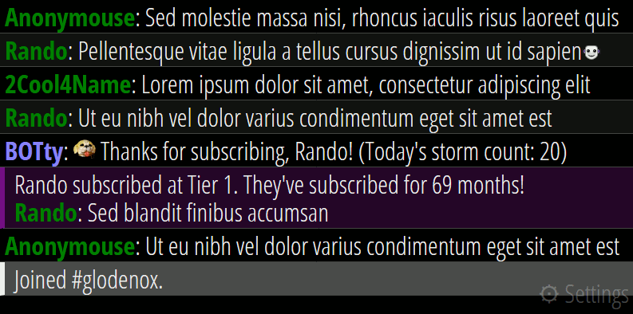

# Twitch Chat Monitor

A tool that monitors and displays Twitch chat channels in a bigger font, ideal for displaying on a big monitor for room-scale Twitch streaming.

## Supported features (non-exhaustive list)

Note that all these features can be enabled or disabled.

* Smooth scrolling of chat messages to improve readability of a fast-flowing chat
* Message rate limiting and message overflow disposal
* Fully customizable color palette
* New messages can be set to appear at the top or the bottom of the screen
* Show or hide moderator actions
* Highlight messages based on the username or certain keyphrases
* Immediately show the images posted by users
* Load Twitter messages linked to by users
* Shorten links posted in chat
* Store settings over sessions or adjust default settings in the HTML page for portability
* Show timestamps next to messages

Several more features are in [the pipeline](https://github.com/Glodenox/twitch-chat-monitor/issues)!

## Usage

By opening the web page, the monitor will connect to the default Twitch channel or the channel you monitored most recently. At the top or bottom right you can find the settings menu. In this menu it is possible to modify all configuration options. These settings are stored in your browser and become active immediately when changed. Do note that some message-related settings will only have an effect on new incoming messages.

## How to get

### Available pre-hosted on github.io

The latest version of the tool is available at [https://glodenox.github.io/twitch-chat-monitor/](https://glodenox.github.io/twitch-chat-monitor/) and can be used from there.

### Hosted on your own domain or as a local web page

If you want to have some predefined settings set (like the channel), you can host the tool yourself. You just need to [download the files](https://github.com/Glodenox/twitch-chat-monitor/archive/master.zip) and place these on a server. Alternatively you can also just open the `index.html` file locally.

The project consists of 4 files:

* *index.html*: the web page you want to open in a browser to see the chat
* *main.js*: main JavaScript file
* *tmi.js*: a copy of the [tmi.js JavaScript library for Twitch](https://github.com/tmijs/tmi.js)
* *style.css*: CSS styles are stored here

## Acknowledgments

This tool is heavily based on the [Nifty Chat Monitor userscript](https://github.com/paul-lrr/nifty-chat-monitor), but uses the Twitch WebSocket API directly instead of transforming the Twitch chat embed page.
A special thanks to the LoadingReadyRun chat for giving feedback on several of the features!
